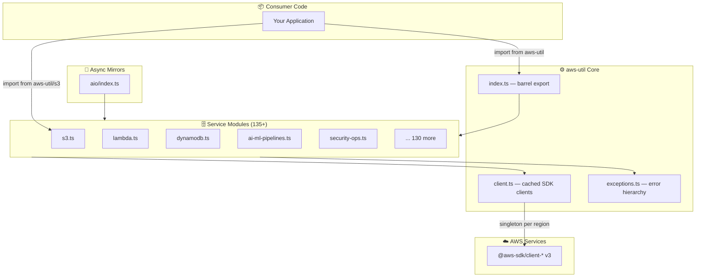
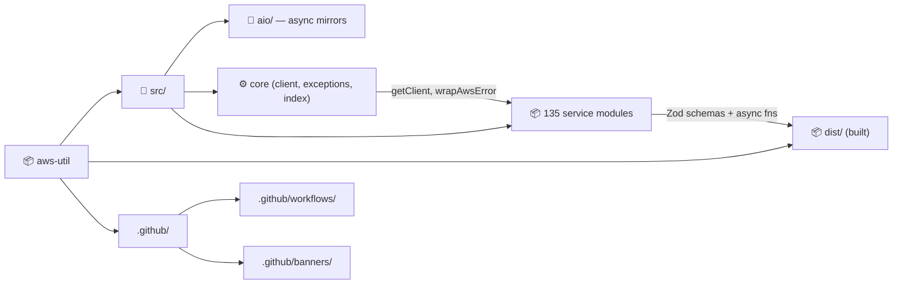
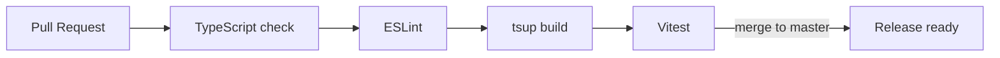

<!-- README auto-maintained. Update this file whenever: code structure changes,
     new env vars added, commands change, new workflows added, or deps updated. -->

<div align="center">

*— project —*

<!-- Project Banner: sdk-circuit-trace -->
<a href="https://www.masrikdahir.com">

</a>

*— author —*

<!-- Author Banner: cloud-packet-burst -->
<a href="https://www.masrikdahir.com">

</a>

> A typed TypeScript SDK that wraps 135+ AWS service modules with Zod-validated schemas, cached SDK v3 clients, and 2,800+ ready-to-call async utility functions.

[](https://github.com/Masrik-Dahir/aws-util/actions/workflows/ci.yml)
[](LICENSE)
[](https://www.typescriptlang.org/)
[](https://nodejs.org)
[](https://docs.aws.amazon.com/AWSJavaScriptSDK/v3/latest/)

</div>

---

<p align="center">
  
</p>

## ⚡ TL;DR

- **What:** A comprehensive TypeScript library that wraps 135+ AWS service modules with fully typed async helper functions, Zod-validated result schemas, and TTL-aware cached SDK v3 clients.
- **Who:** TypeScript/Node.js backend engineers who need to interact with AWS services without writing boilerplate SDK wiring, error classification, or pagination logic.
- **Why:** Unlike raw SDK usage, every function here handles pagination, error normalization, and caching out of the box — so you call `uploadFile(bucket, key, body)` instead of constructing command objects and chasing SDK types.
- **Start:** `npm install aws-util` then `import { uploadFile } from "aws-util/s3"` — AWS credentials from your environment are picked up automatically.
- **Know:** Requires Node.js 18+ and AWS credentials (env vars, IAM role, or `~/.aws/credentials`); all functions are stubs with `TODO` bodies in `v2.0.0-beta` and will throw until implemented.

---

## 📋 Table of Contents

- [⚡ TL;DR](#-tldr)
- [✨ Features](#-features)
- [🏗️ Architecture](#️-architecture)
- [📁 Project Structure](#-project-structure)
- [⚙️ Prerequisites](#️-prerequisites)
- [🚀 Quick Start](#-quick-start)
- [🔧 Configuration](#-configuration)
- [📖 Usage](#-usage)
- [🧪 Testing](#-testing)
- [🔄 CI/CD](#-cicd)
- [🤝 Contributing](#-contributing)
- [📝 Changelog](#-changelog)
- [📄 License](#-license)

---

## ✨ Features

- 🟧 **135 AWS Service Modules** — Dedicated TypeScript modules for S3, DynamoDB, Lambda, EC2, ECS, SQS, SNS, SES, IAM, KMS, Bedrock, SageMaker, Glue, Athena, Redshift, QuickSight, and 100+ more
- ⚡ **2,800+ Typed Async Functions** — Every public function is `async`, returns a typed `Promise`, and wraps SDK v3 commands with automatic error classification
- 🔒 **Zod-Validated Schemas** — Every result type is backed by a `z.object(...)` Zod schema and exported alongside the function for runtime validation
- 🗂️ **TTL-Aware Client Caching** — `getClient()` returns a singleton AWS SDK client per service+region, eliminating cold-start overhead in Lambda
- 🚦 **Unified Error Hierarchy** — `AwsThrottlingError`, `AwsNotFoundError`, `AwsPermissionError`, `AwsConflictError` and more — all derived from `AwsUtilError` for structured catch blocks
- 🔄 **Automatic Pagination** — List operations handle `NextToken` / `NextMarker` internally and return complete result sets
- 🌐 **Dual CJS + ESM Output** — Built with `tsup` to `dist/` as both CommonJS and ES Module with full `.d.ts` declarations
- 🤖 **AI/ML First-Class Support** — Bedrock, SageMaker, Rekognition, Comprehend, Textract, Translate, Transcribe, Polly, Personalize, Forecast all covered

---

## 🏗️ Architecture



---

## 📁 Project Structure

```
📦 aws-util/
├── 📁 src/
│   ├── 📁 aio/                # Async re-export mirrors of all modules
│   │   └── 🔑 index.ts
│   ├── ⚙️  client.ts           # TTL-aware cached AWS SDK client factory
│   ├── ⚠️  exceptions.ts       # Unified error hierarchy (AwsUtilError subtypes)
│   ├── 🔑  index.ts            # Barrel export of all public APIs
│   ├── 📦  s3.ts               # S3 helpers (upload, download, presign, list…)
│   ├── 📦  dynamodb.ts         # DynamoDB helpers (getItem, putItem, query…)
│   ├── 📦  lambda.ts           # Lambda invoke, deploy, list versions…
│   ├── 📦  ai-ml-pipelines.ts  # Bedrock, Rekognition, Comprehend, Textract…
│   ├── 📦  analytics-pipelines.ts # Redshift, Athena, Glue, QuickSight, EMR…
│   ├── 📦  security-ops.ts     # Cognito, WAF, Shield, ACM, CloudFront…
│   ├── 📦  governance.ts       # Config Rules, Organizations, SSO, KMS audits
│   ├── 📦  finding-ops.ts      # Inspector, Macie, Detective, SecurityHub…
│   ├── 📦  deployment.ts       # CloudFront, Beanstalk, App Runner, EKS…
│   ├── 📦  resilience.ts       # Circuit breaker, distributed lock, timeout…
│   ├── 📦  observability.ts    # CloudWatch, X-Ray, Kinesis Analytics, Health…
│   └── 📦  [128 more modules]
├── 📁 dist/                    # Compiled CJS + ESM output (generated)
├── 📁 .github/
│   ├── 📁 banners/             # Animated SVG author & project banners
│   ├── 📁 screenshots/         # Hero screenshots
│   └── 📁 workflows/           # GitHub Actions CI/CD pipelines
├── ⚙️  package.json
├── ⚙️  tsconfig.json
├── ⚙️  tsup.config.ts
└── 📖  README.md
```



---

## ⚙️ Prerequisites

| Tool | Version | Install |
|------|---------|---------|
| Node.js | ≥ 18.x | [nodejs.org](https://nodejs.org) |
| npm | ≥ 9.x | Comes with Node.js |
| AWS credentials | — | [AWS CLI configure](https://docs.aws.amazon.com/cli/latest/userguide/cli-configure-quickstart.html) |
| TypeScript *(dev)* | ≥ 5.0 | `npm install -D typescript` |

> **Tip:** Set `AWS_REGION`, `AWS_ACCESS_KEY_ID`, and `AWS_SECRET_ACCESS_KEY` in your environment, or configure an IAM role if running on AWS infrastructure (EC2, Lambda, ECS). The SDK v3 credential chain resolves automatically.

---

## 🚀 Quick Start

### 1. Install the package

```bash
npm install aws-util
```

### 2. Configure AWS credentials

```bash
# Option A — environment variables
export AWS_REGION=us-east-1
export AWS_ACCESS_KEY_ID=AKIA...
export AWS_SECRET_ACCESS_KEY=...

# Option B — AWS CLI profile
aws configure
```

### 3. Import and call a helper

```typescript
import { uploadFile, downloadBytes, generatePresignedUrl } from "aws-util/s3";
import { sendMessage, receiveMessages } from "aws-util/sqs";
import { getItem, putItem, queryItems } from "aws-util/dynamodb";
import { invokeLambda } from "aws-util/lambda";

// Upload a buffer to S3
const url = await uploadFile("my-bucket", "images/photo.jpg", buffer, "image/jpeg");

// Send an SQS message
await sendMessage("https://sqs.us-east-1.amazonaws.com/123/my-queue", {
  orderId: "ORD-001",
  status: "shipped",
});

// Query DynamoDB
const items = await queryItems("orders-table", "userId", "user-42");

// Invoke Lambda
const result = await invokeLambda("my-processor-fn", { input: "data" });
```

### 4. Use AI/ML helpers

```typescript
import { bedrockKnowledgeBaseIngestor, rekognitionFaceIndexer } from "aws-util/ai-ml-pipelines";
import { redshiftServerlessQueryRunner, quicksightDashboardEmbedder } from "aws-util/analytics-pipelines";
```

### 5. Async (aio) module

All modules are re-exported under `aws-util/aio` for Python API parity:

```typescript
import { uploadFile } from "aws-util/aio/s3";
import { getItem } from "aws-util/aio/dynamodb";
```

---

## 🔧 Configuration

aws-util uses your existing AWS SDK credentials chain — no library-level configuration file is required. The following environment variables are respected by the AWS SDK v3:

| Variable | Required | Default | Description |
|----------|----------|---------|-------------|
| `AWS_REGION` | ✅ | — | AWS region for all SDK calls (e.g. `us-east-1`) |
| `AWS_ACCESS_KEY_ID` | ✅* | — | IAM access key (*not needed when using an IAM role) |
| `AWS_SECRET_ACCESS_KEY` | ✅* | — | IAM secret key (*not needed when using an IAM role) |
| `AWS_SESSION_TOKEN` | ❌ | — | Temporary session token (STS / assumed roles) |
| `AWS_PROFILE` | ❌ | `default` | Named profile from `~/.aws/credentials` |
| `AWS_MAX_ATTEMPTS` | ❌ | `3` | SDK retry count for throttled/transient errors |

> **Per-call region override:** Every function accepts an optional final `regionName?: string` parameter to override the default region for that single call — useful for cross-region operations.

---

## 📖 Usage

### S3

```typescript
import {
  uploadFile,
  downloadBytes,
  generatePresignedUrl,
  listObjects,
  deleteObject,
  copyObject,
} from "aws-util/s3";

// Upload
const url = await uploadFile("bucket", "key.txt", Buffer.from("hello"), "text/plain");

// Download
const bytes = await downloadBytes("bucket", "key.txt");

// Pre-signed URL (valid 1 hour)
const signedUrl = await generatePresignedUrl("bucket", "private/doc.pdf", 3600);

// List all objects under prefix
const objects = await listObjects("bucket", "uploads/");
```

### DynamoDB

```typescript
import { getItem, putItem, updateItem, deleteItem, queryItems, scanTable } from "aws-util/dynamodb";

await putItem("users", { userId: "u1", name: "Alice", age: 30 });
const user = await getItem("users", { userId: "u1" });
const admins = await queryItems("users", "role", "admin");
```

### Lambda

```typescript
import { invokeLambda, invokeLambdaAsync, updateFunctionCode } from "aws-util/lambda";

const response = await invokeLambda("my-fn", { event: "data" });
await invokeLambdaAsync("my-bg-fn", { job: "report" });
```

### AI/ML Pipelines

```typescript
import {
  bedrockKnowledgeBaseIngestor,
  rekognitionFaceIndexer,
  comprehendPiiRedactor,
  textractFormExtractor,
} from "aws-util/ai-ml-pipelines";

// Ingest documents into a Bedrock knowledge base
const result = await bedrockKnowledgeBaseIngestor(
  "kb-abc123",
  "datasource-xyz",
  "us-east-1"
);

// Detect and redact PII from text
const redacted = await comprehendPiiRedactor(
  "John Smith lives at 123 Main St",
  ["NAME", "ADDRESS"]
);
```

### Security Operations

```typescript
import {
  wafIpBlocklistUpdater,
  acmCertificateExpiryMonitor,
  cognitoGroupSyncToDynamodb,
} from "aws-util/security-ops";

import {
  securityHubFindingRouter,
  inspectorFindingToJira,
  cloudtrailAnomalyDetector,
} from "aws-util/finding-ops";
```

### Analytics Pipelines

```typescript
import {
  redshiftServerlessQueryRunner,
  athenaResultToDynamodb,
  emrServerlessJobRunner,
  quicksightDashboardEmbedder,
} from "aws-util/analytics-pipelines";

const queryResult = await redshiftServerlessQueryRunner(
  "my-workgroup",
  "my-db",
  "SELECT COUNT(*) FROM orders WHERE created_at > CURRENT_DATE - 7"
);
```

---

## 🧪 Testing

```bash
# Run all tests
npm test

# Run with coverage report
npm run test:coverage

# Watch mode (re-runs on file save)
npm run test:watch

# Type-check only (no emit)
npm run typecheck
```

### Test stack

| Tool | Purpose |
|------|---------|
| [Vitest](https://vitest.dev/) | Test runner and assertion library |
| [aws-sdk-client-mock](https://github.com/m-radzikowski/aws-sdk-client-mock) | Mock AWS SDK v3 clients without real AWS calls |

### Writing a test

```typescript
import { mockClient } from "aws-sdk-client-mock";
import { S3Client, PutObjectCommand } from "@aws-sdk/client-s3";
import { uploadFile } from "../src/s3";

const s3Mock = mockClient(S3Client);

beforeEach(() => s3Mock.reset());

test("uploadFile returns the S3 URL", async () => {
  s3Mock.on(PutObjectCommand).resolves({ ETag: '"abc"' });
  const url = await uploadFile("my-bucket", "file.txt", Buffer.from("hi"));
  expect(url).toContain("my-bucket");
});
```

---

## 🔄 CI/CD

This project uses GitHub Actions for automated testing, building, and banner archiving.

| Workflow | File | Trigger | Purpose |
|----------|------|---------|---------|
| CI | `ci.yml` | Push / PR to `master` | Type-check, lint, build, test across Node 18/20/22 |
| Banner Archive | `banner-archive.yml` | Push to `.github/banners/` | Validate and archive animated SVG banners |

### Pipeline Flow



> All checks must pass before merging. See [`.github/workflows/`](.github/workflows/) for full configuration.

---

## 🤝 Contributing

Contributions are welcome! Please follow these steps:

1. **Fork** the repository
2. **Create** a feature branch: `git checkout -b feat/amazing-feature`
3. **Implement** the function stub — replace the `TODO` body with real SDK calls
4. **Add a test** using `aws-sdk-client-mock`
5. **Commit** your changes: `git commit -m 'feat(s3): implement uploadFile'`
6. **Push** to the branch: `git push origin feat/amazing-feature`
7. **Open** a Pull Request

### Commit Convention

This project uses [Conventional Commits](https://www.conventionalcommits.org/):

| Prefix | Use for |
|--------|---------|
| `feat:` | New module or function implementation |
| `fix:` | Bug fix in an existing function |
| `docs:` | Documentation only |
| `chore:` | Build / tooling changes |
| `test:` | Adding or fixing tests |
| `refactor:` | Code restructuring without behaviour change |

### Implementing a stub function

Each stub follows this pattern — replace the `throw new Error(...)` with real SDK code:

```typescript
export async function myFunction(param: string, regionName?: string): Promise<MyResult> {
  try {
    const client = getClient(S3Client, { region: regionName });
    const response = await client.send(new GetObjectCommand({ Bucket: param, Key: "..." }));
    return { success: true, data: response.Body };
  } catch (err) {
    throw wrapAwsError(err as Error, "myFunction failed");
  }
}
```

> Please ensure all tests pass and `npm run typecheck` reports zero errors before opening a PR.

---

## 📝 Changelog

| Version | Date | Changes |
|---------|------|---------|
| v2.0.0 | 2026-04-15 | +100 new functions across 9 new modules and 10 extended modules; +27 AWS SDK dependencies; 135 total modules |
| v1.0.0 | 2026-04-13 | Initial release — 61 modules covering 32+ AWS services |

Full changelog: [CHANGELOG.md](CHANGELOG.md)

---

## 📄 License

Distributed under the MIT License. See [`LICENSE`](LICENSE) for more information.

---

<div align="center">

Made with ❤️ by **[Masrik Dahir](https://www.masrikdahir.com)**

⭐ Star this repo if you find it helpful!

</div>
